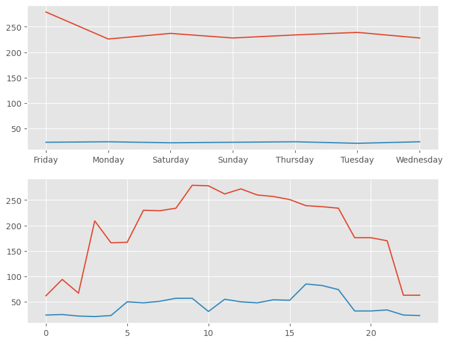

# -Traffic-Analysis-Prediction-System
his project analyzes vehicle traffic patterns using:
- Pandas
- NumPy
- Matplotlib
- Scikit-learn
 
It can:
- analyze traffic trends
- visualize traffic patterns
- predict traffic based on time and vehicles

Author : Tejasvni Pawar